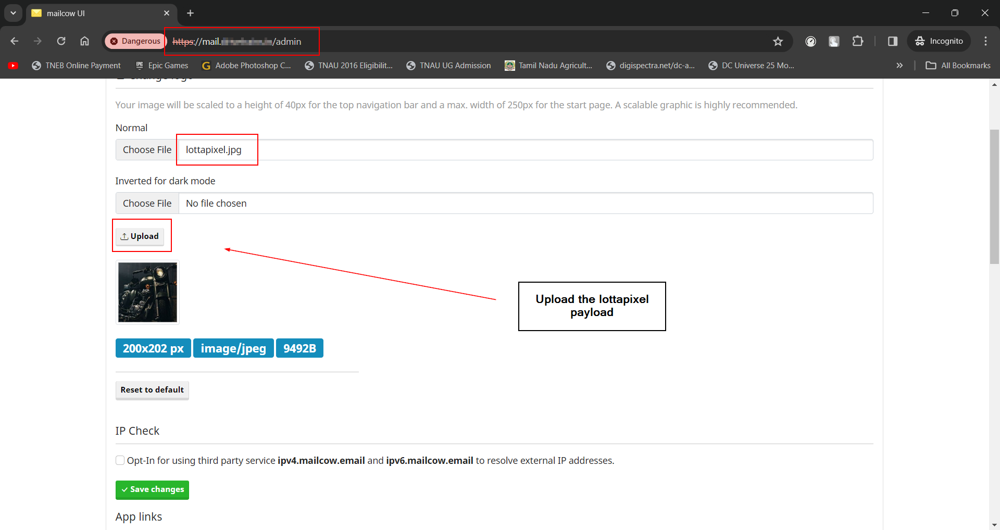
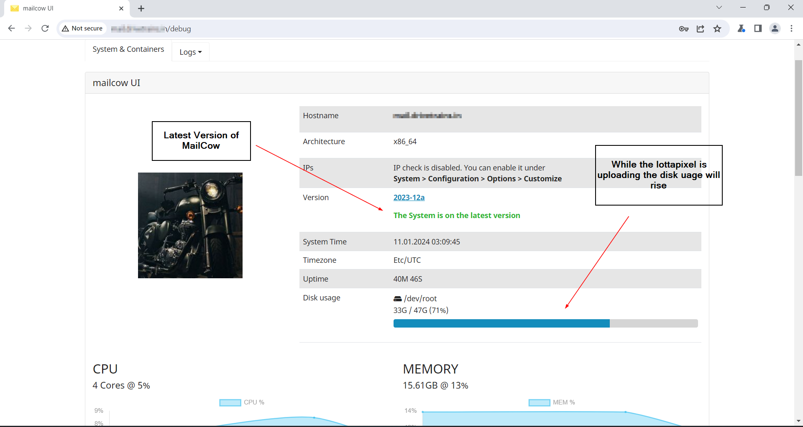
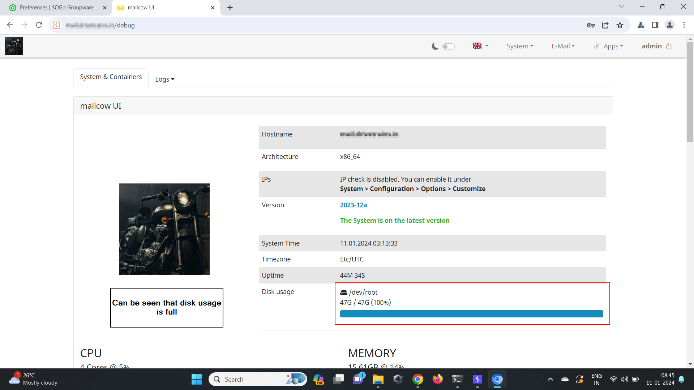

# MailCow-Pixel-Flood-Attack
#### Description:
The application is vulnerable to pixel flood attack, once the payload has been successfully uploaded in the logo the application begans to slow and the admin page doesn't respond.

#### Affected Version: 2023-12a

#### Steps to reproduce:
1. Set up an mailcow-docerized SMTP server.
2. Login to the admin page and navigate to the "customize" functionality.
3. Now change the logo to "lottapixel.jpg" and wait until it gets fully uploaded. Note: It will take some minutes to upload the lottapixel.jpg
  
  
  
4. After the successful upload it can be observed that the mail server will not respond properly and if the server spec is low it will also make the server go down and collapse.

#### PoC:
The admin page becomes unresponsive after the payload is uploaded.
https://github.com/0xbunniee/MailCow-Pixel-Flood-Attack/assets/137713379/35e23bf6-c392-446c-824a-4a92e6736536

#### Impact:
The admin will not be able do anything as the admin page is completely become unresponsive which quite causes a pandemonium as no one has control over the mail server and cant do anything. As the MailCow is running the services in containers only the admin page is affected and others services like mail etc operates good. 
